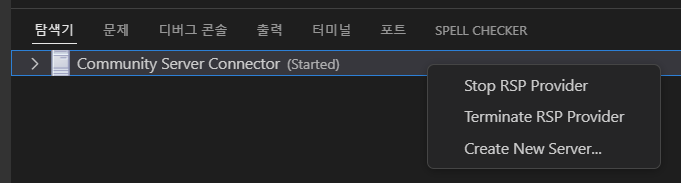
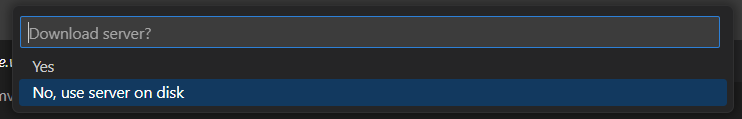
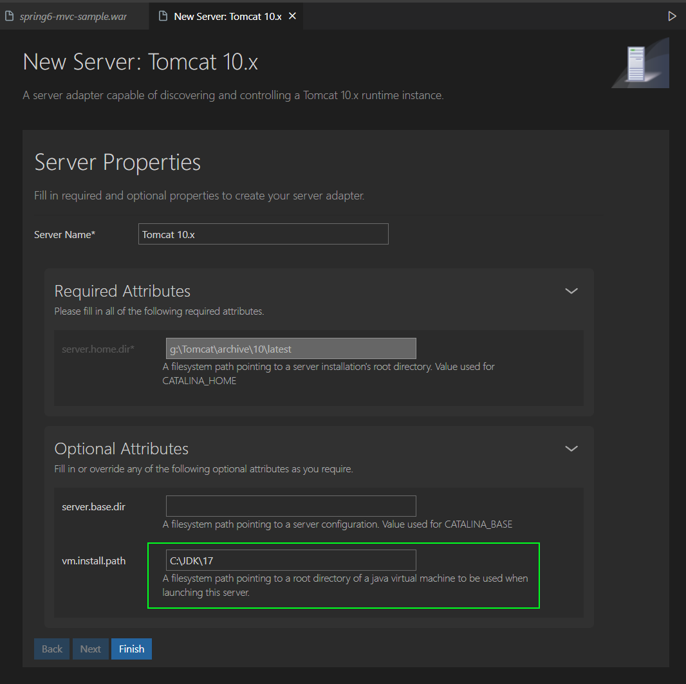
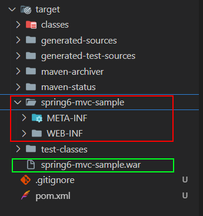
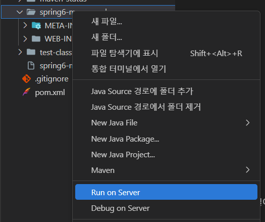
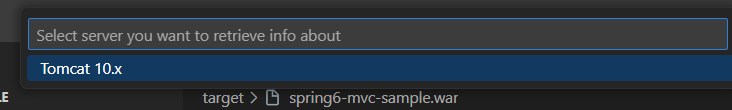
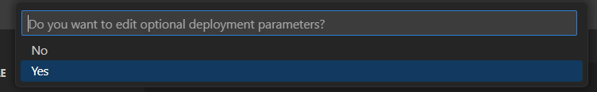
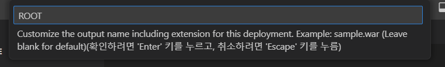
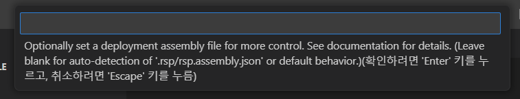
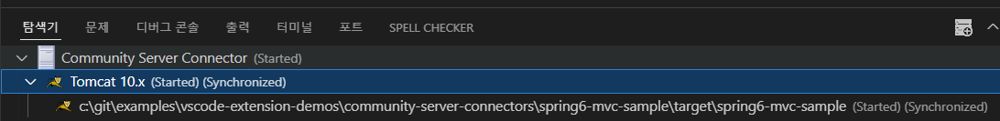

# Community Server Connectors 동작 테스트 데모

> VSCode에는 IntelliJ나 Eclipse만큼 편하게 사용할 수 있는 Tomcat 연동을 할 수 있는 확장이 거의 없다고 느끼는 편인데.. 🥲
>
> 그래도 널리 쓰이고 있는 것 같은 Community Server Connectors를 동작을 테스트 해봤다.
>
> 적용 예제 프로젝트는 단순히 Hello world! 페이지를 노출하는 Spring MVC 프로젝트이고 Java Config 기반 설정으로 되어있다.


* Runtime Server Protocol - Community Extension
  * https://github.com/redhat-developer/rsp-server-community
* Runtime Server Protocol UI
  * https://github.com/redhat-developer/vscode-rsp-ui


### 적용 예제 프로젝트

* [spring6-mvc-sample](spring6-mvc-sample)


실행을 하는 주체는 Runtime Server Protocol - Community Extension 이고 이게 9000포트로 실행됨,

VSCode에서 UI조작은 Runtime Server Protocol UI로 따로 분리한 것 같음.


## .vscode/settings.json (워크스페이스 설정)

```json
{
  "maven.terminal.favorites": [
    {
      "command": "clean package war:exploded -DskipTests",
      "debug": false
    },
    {
      "command": "clean package -DskipTests",
      "debug": false
    }
  ],
  "rsp-ui.rsp.java.home": "C:\\JDK\\17",
  "rsp-ui.enableStartServerOnActivation": [
    {
      "id": "redhat.vscode-community-server-connector",
      "name": "Community Server Connector",
      "startOnActivation": true
    }
  ]
}
```


### Maven 즐겨찾기 커맨드 추가

Community Server Connectors가 배포방식을 File과 Exploded를 지원해서 war:exploded와 package를 추가했다.

처음에는 pacage를 빼고 `war:exploded` 또는 `war:war`로만 하면, 누락되는 파일이 있었음. `package`를 꼭 해줘야했음


## "rsp-ui.rsp.java.home"

rsp ui가 사용할 Java 런타임 경로인데, 이게 나중에 서버 옵션 수정에서 `vm.install.path`를 따로 지정하지 않으면, Tomcat도 이 경로의 Java로 실행이된다.

처음 확장을 설치하고 에러 경고가 나오는데.. 이 경로부터 제일 먼저 설정해주고 재시작 해주자!


### "startOnActivation" 

시작할 때.. Community Server Connector 서버를 실행할 지 여부인데.. User Settings에서는 false로  설정해두면 될 것 같음..

Tomcat 서버를 사용하는 Java 프로젝트일 때만, Workspace Settings에다 true 설정해두면 될 것 같다.


## 서버 등록

아래 위치에서 오른쪽 마우스 메뉴열어서 Create New Server... 클릭!



나는 이미 사용하고 있는 것 쓸 것 이므로 No, use server on disk 선택..



나는 다음에 나올 경로 선택화면에서 Tomcat 10이 설치된 경로를 선택했고, 그러면 다음과 같이 나온다.

vm.install.path는 이 Tomcat을 실행시킬 Java 런타임 경로이다. 비워두면 "rsp-ui.rsp.java.home"에 설정했던 값을 사용함.




## 실행

package + war:exploded로 실행하면, 톰켓에다 war를 배포할 수도 있고, war의 압축이 풀린경로도 배포를 할 수 있는 상태가 되는데..

target을 보면 다음과 같이 아티팩트 이름으로 된 폴더하고(exploded), 아티펙트 명.war로 된 파일을 볼 수 있다.



exploded된 폴더에서 오른쪽 메뉴 마우스를 열어 Run on Server를 실행해주자!



어떤 서버로 실행할지 선택창이 나오는데.. 나는 10 그래도 선택




선택적 배포 파라미터를 편집하길 원하시나요? Yes



나는 Context Path없이 Root로 쓸 것이여서... ROOT 입력..  만약 exploded 폴더 배포가 아니고 File(war) 배포 였다면 ROOT.war로 적어야했다.




추가 설정은 하지 않고 그냥 엔터. (여기다 뭐를 넣야할지.. 뭔가 가이드가 부족한 것 같다.🥲)




이후 탐색기를 보면은  실행이 잘 됨을 알 수 있다.




---


## 후기

IntelliJ나 Eclipse에 비하면 상당히 불편한 면이 있긴하지만... 그래도 계속 꾸준히 기능개선하면서 발전했으면 좋겠다. 👍👍👍

